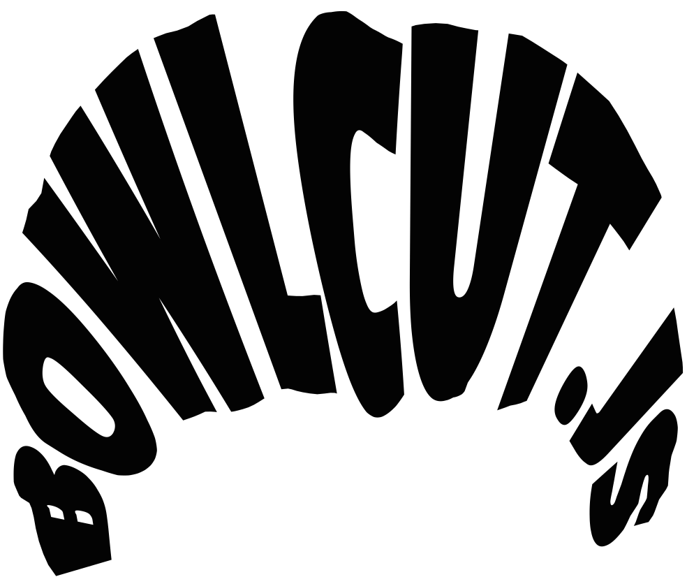

##A library for hairy SVG text manipulation
Written by Duncan Alexander, 2015-17

##Installation
Bowlcut has two dependencies: [Bezier.js](https://pomax.github.io/bezierjs/) and [Opentype.js](http://opentype.js.org/). Please be sure to include them with your local installation of Bowlcut.

##Use
A Bowlcut object is a renderable collection of styled text grouped into regions. These regions reference properties on the Bowlcut object for their styling, and have some properties of their own. Here's an example of how to set up a Bowlcut object.

```
	var wordmark = new Bowlcut();

	wordmark.text = ['example', 'wordmark'];	// strings to reference
	wordmark.colors = ['#ff0000' '#00ccff'];	// css-valid colors
	wordmark.fonts = [collegiate, fullBlock];	// OpenType.js font objects. Must be preloaded.

	/* other properties:
		precision (decimal places, defaults to 3)
		debug (true / false). Shows paths defining the regions
		uniqueId (hex string set up by the constructor)
	*/
```

Region objects define the position, styling, and bounding paths of text in the Bowlcut object. First properties are passed to the constructor, then the bounding paths are set.

```
	//some example region data
	var dataA = {
		bounds: {
			x: 128,
			y: 128,
			width: 256,
			height: 64
		},
		font: 1, // use the index of the font in the Bowlcut object
		fill: 0,
		stroke: 1,
		slice: {
			0: []	// key is the index of the string
					// value is an array of arguments for String.slice()
		},
		topPath: null,	// you can pass path elements here if you like
						// there are convenience methods detailed below for common shapes
		bottomPath: null,
		stretchToWidth: false //default is false. Set to true to fill bounds when text width < bounds width
							  // otherwise text will be centered in the bounds
	};

	var dataB = {
		bounds: {
			x: 128,
			y: 224,
			width: 256,
			height: 64
		},
		font: 0,
		fill: 1,
		stroke: null,
		slice: {
			1: [4] // will return 'mark'
		},
		topPath: null,
		bottomPath: null
	};

	var regionA = wordmark.addRegion(dataA);
	var regionB = wordmark.addRegion(dataB);
```

Here's what setting up the bounding paths looks like.

```
	regionA.makeRadialArch(0.5); //value of 0-1

	regionB.makeArch(0, 0.3);	// creates a bridge arch, with a flat top and a curved-up bottom
								// these values are on a scale of 0-1 with respect to the bounds height

	//also available: region.makeStraightPaths() for unwarped regions
```

Finally, to render:

```
	someSvg.appendChild(wordmark.render());

	//the render() function returns an SVG group of paths representing the regions.
```

And the final output:


This example is provided as working code under `test/index2.html` in the repository.

##Upcoming features
- Negative values for radial arch
- Further incorporation of Bezier.js LUT functionality and point sampling
